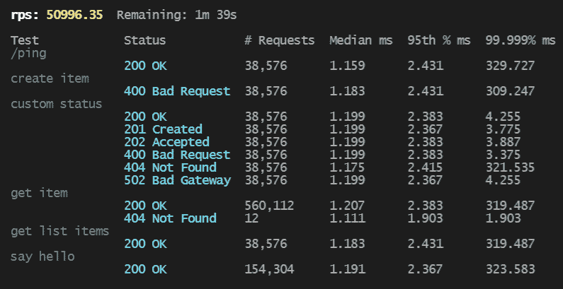

# Fatigue


[![Continuous Integration][ci-badge]][ci-url]
[![Crates.io][crates-badge]][crates-url]
[![docs.rs][docs-badge]][docs-url]
[![docs.rs][license-badge]][license-url]

[ci-badge]: https://github.com/pdylanross/fatigue/actions/workflows/ci.yaml/badge.svg
[ci-url]: https://github.com/pdylanross/fatigue/actions/workflows/ci.yam
[docs-badge]: https://img.shields.io/docsrs/libfatigue
[docs-url]: https://docs.rs/libfatigue/latest/libfatigue/
[crates-badge]: https://img.shields.io/crates/v/libfatigue.svg
[crates-url]: https://crates.io/crates/libfatigue
[license-badge]: https://img.shields.io/crates/l/libfatigue
[license-url]: https://github.com/pdylanross/fatigue/blob/main/LICENSE

A load testing tool that's sure to cause stress fractures.


## Overview

fatigue is a load testing tool with a simple, yet expressive, config format that makes it easy to topple your services in a matter of minutes. It boasts impressive request per second rates while respecting your system's resources. 

## Quick Start

1. Run the test API.
   > `cargo run -p test-api`
2. Run fatigue 
   > `fatigue -p ./examples/simple.yaml`

## Configuration

The configuration syntax is divided into three sections. A complete example of all of the features of the configuration file syntax can be seen in `examples/complete.yaml`.

Configuration values can be overridden with environment variables prefixed via `fatigue` with a dot as the separator (ie `fatigue.run.base_url=http://localhost:8000`). See [figment documentation](https://docs.rs/figment/latest/figment/) for more information.

### run

This section describes basic information about the load test run.
```yaml
run:
  base_url: http://localhost:8000
  concurrency: 32
  duration:
    timed:
      duration: 20s
      warm_up: 1s
```

Test duration can also take a hard coded amount of iterations. An iteration is a single iteration of all of the actions in a given plan. Multiple concurrent workers will contribute to the iteration count.

```yaml
run:
  ...
  duration:
    iteration:
      iterations: 1000
      warm_up: 1s
```


### static_context

The context is data that flows between actions. Actions can modify a context within their given iteration, but we will often want to setup the context once for the entire test run. Static context information is saved under a key based on the static context action's name. Each static context action will have a default name if one is not set, and subsequent context actions can override prior context actions if there are name conflicts. 

#### literal

The literal context action takes any value in properties and assigns it to the context key dictated by `name`. 

```yaml
static_context:
  - type: literal
    name: users
    properties:
      names:
        - bob
        - john
      ages:
        - 1
        - 2
```


#### json

The json context action can load a json file, or load raw json.

```yaml
static_context:
  - type: json
    name: json-from-file
    properties:
      path: ./test-1.json
  - type: json
    name: json-from-raw
    properties:
      raw: |
        {
          "a": "b"
        }
```

### csv

The csv context action loads csvs, using header names if present or numbered columns if not.

```yaml
static_context:
  - type: csv
    name: with-header
    properties:
      path: ./with_header.csv
  - type: csv
    name: without-header
    properties:
      path: ./without_header.csv
      has_headers: false
```

To use header-less csvs, you must use bracket notation to access the fields.

```yaml
actions:
  - type: request
    name: say hello - csv without header
    properties:
      path: |
        
            /hello/{{item["0"]}}/{{item["2"]}}
        
```

### actions

### request

The request action sends an http request.

```yaml
actions:
  - type: request
    properties:
      path: /ping
```

`path` is required at a minimum, however this becomes much more flexible when combined with [liquid templating](https://shopify.github.io/liquid/). Both `path` and `body` support liquid templates, and the context is present for these templating operations. The response body from a prior http call can also be saved into the current context, and then re-used in later http calls. In order to inject the response body into the context, `response_context_key` must be set.

```yaml
actions:
  - type: request
    name: get list items
    properties:
      path: /list
      response_context_key: items
  - type: request
    name: get item
    properties:
      path: |
        
            /list/{{id}}
        
  - type: request
    name: create item
    properties:
      path: /list
      method: POST
      body: |
        {
          "id": "{{items[0]}}",
          "data": "{{items[0]}}"
        }
```

### delay

The delay action puts a pause in the action chain. `milliseconds` or `seconds` must be defined, but cannot both be defined.

```yaml
actions:
  - type: delay
    properties:
      milliseconds: 10
  - type: delay
    properties:
      seconds: 1
```

### print_context

print_context is useful for debugging context related issues, and will print the current context to console output. It will run for each iteration, so it's best to keep this disabled when not actively in use.

```yaml
actions:
  - type: print_context
    properties: { }
```

## Extensibility

APIs are still in flux and this section of the documentation is highly likely to change. Once we're to a stable-ish place, this will be written. For now, read the code in `fatigue/src` if you want to learn more about this.

## Contribution

[Contributing](CONTRIBUTING.md)

## Inspiration

This project was inspired by [drill](https://github.com/fcsonline/drill). After using that quite a bit at $DAYJOB I wanted to contribute some changes to that project, but after reviewing the code I realized that some of the things I wanted to do would've required some pretty hefty refactors. I then decided to start from scratch. Props to fcsonline to the great tool - it's saved me a ton of time. 