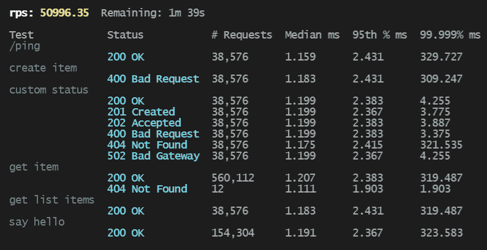

# Fatigue

[![Continuous Integration][ci-badge]][ci-url]
[![Crates.io][crates-badge]][crates-url]
[![docs.rs][docs-badge]][docs-url]
[![docs.rs][license-badge]][license-url]

[ci-badge]: https://github.com/pdylanross/fatigue/actions/workflows/ci.yaml/badge.svg
[ci-url]: https://github.com/pdylanross/fatigue/actions/workflows/ci.yam
[docs-badge]: https://img.shields.io/docsrs/libfatigue
[docs-url]: https://docs.rs/libfatigue/latest/libfatigue/
[crates-badge]: https://img.shields.io/crates/v/libfatigue.svg
[crates-url]: https://crates.io/crates/libfatigue
[license-badge]: https://img.shields.io/crates/l/libfatigue
[license-url]: https://github.com/pdylanross/fatigue/blob/main/LICENSE

A load testing tool that's sure to cause stress fractures.

## Overview

## Quick Start

## Configuration

## Extensibility

